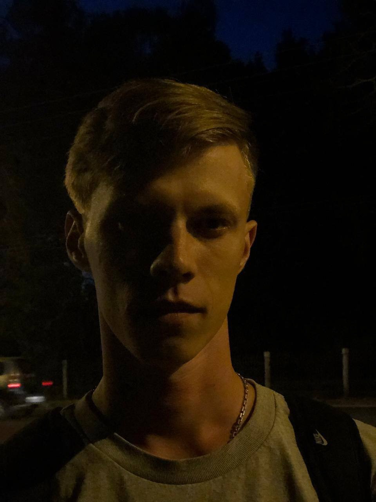

# Биографи Владислава Третьякова

### О пути
---
    Я родом из не большого города под названием Тара что расположился на берегу реки Иртышь где то далеко в Сибири. 
    По исполнению 18 лет уехал в город Омск. Побывал в Владивостоке, Уфе, Новокузнецке, горном Атае, Казахстане, 
    и везде хоть чуть чуть но пожил.

### Чем занимался
---
    Работал. Много. Кем только хотел, пожалуй ключевое слово "кем хотел"
* Кочегар
* Грузчик
* Фасовщик
* Гончар
* Кровельщик
* Промоутер
* Техподдержка
* Торговый представитель
* Монтажник высотник
Одним словом живу по правилу 

>Не позволяй душе лениться!
>
>Чтоб в ступе воду не толочь,
>
>Душа обязана трудиться
>
>И день и ночь, и день и ночь!
>
>**Николай Заболоцкий**

Сейчас я учусь, сново, и считаю что самое важное в нашей жизни это учиться !!!
